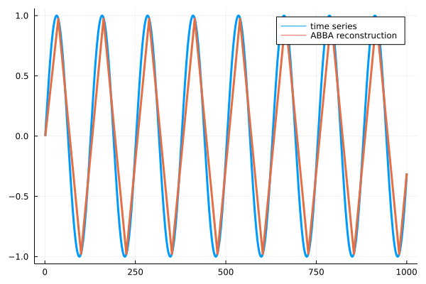
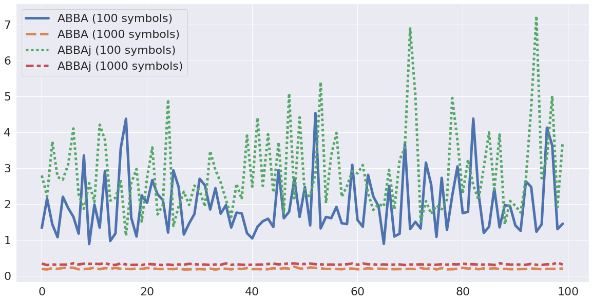
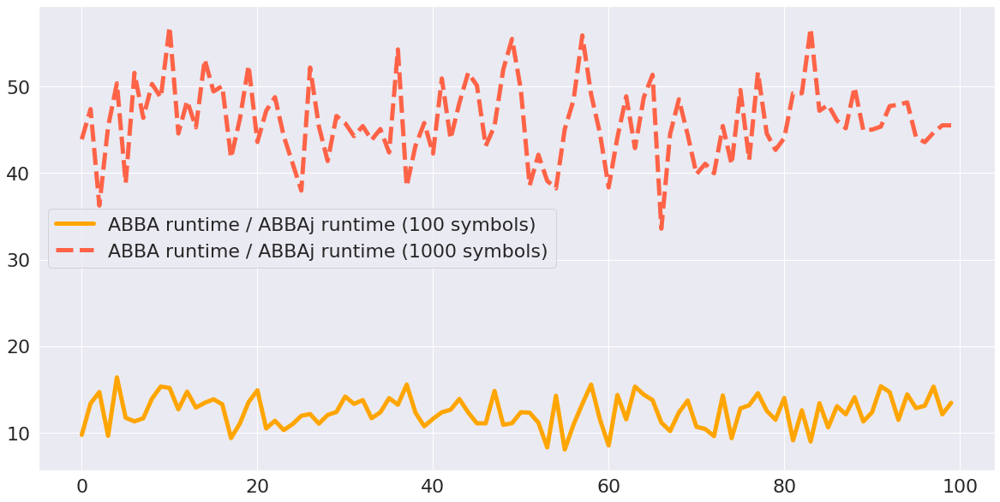

# ABBAj

[](https://app.travis-ci.com/github/nla-group/ABBAj.jl)
[](https://github.com/nla-group/ABBAj.jl/actions)
[](https://codecov.io/gh/nla-group/ABBAj.jl)
[](https://opensource.org/licenses/BSD-3-Clause)
[](https://mybinder.org/v2/gh/nla-group/jlABBA/HEAD)

A Julia version of ABBA with parallel k-means implementation 
> + Documentation: [](https://nla-group.github.io/ABBAj.jl/dev/)

ABBA (Adaptive Brownian bridge-based aggregation) is a symbolic time series representation method introduced by Elsworth Steven and Stefan Güttel, which archives time-series compression and discretization by transforming time series into a symbolic representation. The software fABBA (https://github.com/nla-group/fABBA) already provides ABBA transformation with appealing speed and tolerance-oriented digitization. Now our application of interest is that possible to accelerate ABBA by preserving k-means clustering? The package provides lightweight Julia implementation of the ABBA method, also use ParallelKMeans.jl to achieve speedup in the digitization. 

## Installation
You can simply install the stable version of this package by running in Julia:

```julia
pkg> add ABBAj
```


## Examples

```julia
julia> time_series = load_sample(); # load time series samples 
julia> symbols, model = fit_transform(time_series, 4, 0.1); # use 4 symbols with compressed tolerance of 0.1
julia> r_time_series = inverse_transform(symbols, model, time_series[1]); # inverse transform time series
```



## Julia ABBA VS Python ABBA
We run ABBAj and ABBA in 100 random noises generated from normal distribution by specifying the number of symbols at 100, 1000, respectively. 

The root-mean-square deviation:


Runtime:


### Software Contributors
* Equal contributions.
```
Xinye Chen (orcidID:0000-0003-1778-393X) 
Stefan Güttel (OrcidID:0000-0003-1494-4478)
```


### Referece
Elsworth, S., Güttel, S. ABBA: adaptive Brownian bridge-based symbolic aggregation of time series. Data Min Knowl Disc 34, 1175–1200 (2020). https://doi.org/10.1007/s10618-020-00689-6
