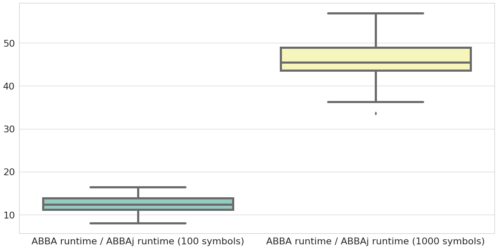

# Summary

Adaptive Brownian bridge-based aggregation (ABBA) [@EG19b] is a symbolic time series representation method that is applicable to general time series. It is based on an adaptive polygonal chain approximation, followed by a mean-based clustering algorithm. Compared to raw data, transforming time series into a sequence of symbols with ABBA enjoys numerous benefits including dimensionality reduction, noises reduction, features discretization, and so on. ABBA follows two steps to symbolize time series, namely compression, and digitization, to transform time series into its symbolic representation. The benefits of symbolic time series representation by ABBA include but are not limited to: (1) ABBA symbolic representation is better at preserving the original shape of time series through the empirical results in performance profiles [@EG19b]; (2) the symbolic sequence can reflect the local up and down behavior of the time series and help find the repeated motif in time series. (3) With respect to time series forecasting, symbolic representation transformed by ABBA has recently been demonstrated to reduce sensitivity to the LSTM hyper-parameters and the initialization of random weights against original time series [@EG20b].  

There are already ABBA variants available in Python such as fABBA [@CG22a]. As a member of the ABBA family, fABBA, by replacing k-means clustering, achieves digitization based on greedy aggregation, which obtains appealing speedup and tolerance-oriented digitization (i.e., without the requirement of prior knowledge for specifying the number of distinct symbols). Now our application of interest focuses on the question of if it is possible to accelerate ABBA by preserving k-means clustering? The package provides lightweight Julia implementation of the ABBA method, using `ParallelKMeans.jl` to achieve speedup in digitization with parallel k-means implementation. However, the current digitization based on k-means with scikit-learn [@scikit-learn] does not achieve satisfying speed in this application. We propose a lightweight Julia package for implementing speedup ABBA, called `ABBAj.jl`. On top of leveraging the appealing speed of Julia compared with Python, `ABBAj.jl` uses the digitization method based on the light Julia package `ParallelKMeans.jl` to accelerate the ABBA algorithm. As shown in \autoref{fig:comsort_center}, we generate 100 Gaussian white noise series of length 5000 with a mean of 0.0 and a standard deviation of 1.0, and run 'ABBAj.jl' and official ABBA in Python, the empirical result demonstrates the `ABBAj.jl` compares favorably to ABBA in Python regarding runtime. 

# Statement of Need

Symbolizing time series may potentially allow avail of useful data structures and techniques from the text processing and bioinformatics communities [@SAX03]. `ABBAj.jl` is a Julia module for time series transformation with ABBA. With `ABBAj.jl`, we can efficiently employ ABBA to symbolize time series and apply the symbolic representation to the downstream time series task such as time series classification, forecasting, and anomaly detection. Compared to the ABBA python module, `ABBAj.jl` enjoys significantly faster speed while retaining the consistent reconstruction error of representation.  

# Acknowledgements

I would like to express my special thanks of gratitude to my supervisor Prof. Stefan Güttel who gives valuable advice for this software.

# References
